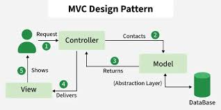

# Model-View-Controller (MVC)



## 1. What does MVC stand for? and what is the primary responsibility of each part (Model, View, Controller)?

- `MVC`: Shortcut for Model, View, Controller.
- `Model` : Handles data logic, database interactions, and business rules. It is responsible for retrieving, storing, and manipulating data.
- `View` : Handles the presentation layer. It displays data to the user and renders the UI based on the model's data.
- `Controller` : Acts as an intermediary between Model and View. It receives user input, processes requests, interacts with the Model, and selects the appropriate View to render.

## 2. what is a "Router"? Explain simply how it acts like a traffic cop for a website.

A **Router** is a component that maps incoming HTTP requests (URLs and methods) to the specific code that should handle them.

**Traffic cop analogy:**
Imagine a busy intersection with many cars (HTTP requests) coming from different directions. The traffic cop (Router) stands in the middle and directs each car to the correct road. If a car wants to go to `/home`, the cop points it to the home controller. If another car wants `/about`, the cop sends it to the about controller. Without the traffic cop, cars would crash into each other or get lost. Similarly, without a router, a website wouldn't know which code should run for which URL.

```php
    $app->router->get('path', 'Callback')
```


## 3. Many modern frameworks use a single index.php file as a "Front Controller". What does this mean compared to having dozens of separate files like about.php and contact.php?

A **Front Controller** means that every incoming request goes through a single entry point (`index.php`), which then delegates the request to the appropriate handler based on the URL. Instead of having separate physical files like `about.php`, `contact.php`, etc., the framework uses routing to determine which controller and action should handle the request dynamically.

**Comparison:**

| Separate Files | Front Controller |
|---|---|
| Each page has its own PHP file (`about.php`, `contact.php`) | One `index.php` handles all requests |
| URLs map directly to file paths | URLs are abstract and mapped via routing |
| Harder to apply global logic (auth, sessions) | Global logic runs once in `index.php` for all requests |
| More files to maintain | Cleaner structure, easier to maintain |

**Example:**
```php
// public/index.php
require '../bootstrap.php';
$router = new Router();
$router->get('/about', [AboutController::class, 'index']);
$router->get('/contact', [ContactController::class, 'index']);
$router->dispatch($_SERVER['REQUEST_URI']);
```

> This pattern centralizes request handling, making the application more organized and maintainable.


## 4. Why do websites use clean URLs like example.com/users/profile instead of messy URLs like example.com/index.php?page=users&action=profile?

Websites use **clean URLs** because they are more readable, user-friendly, and SEO-friendly compared to messy query-string URLs.

| Clean URL | Messy URL |
|---|---|
| `example.com/users/profile` | `example.com/index.php?page=users&action=profile` |
| Easy to read and remember | Hard to read and remember |
| Better for search engines (SEO) | Less SEO-friendly |
| Looks professional | Looks outdated and technical |
| Easier to share | Can break when copied/shared |

**Key reasons:**

1. **User Experience**: Clean URLs are easier for users to understand, type, and remember.
2. **SEO**: Search engines prefer clean URLs and may rank them higher.
3. **Security**: Query strings can expose internal application structure.
4. **Maintainability**: Clean URLs hide the underlying technology (e.g., `.php`), making future changes easier.


## 5. Why is it considered a terrible idea to put database queries (SQL) directly inside your HTML files?

Putting database queries directly inside HTML files violates the **Separation of Concerns** principle and creates numerous problems:

**1. Mixing Logic with Presentation**
HTML should only handle how content looks (presentation). SQL handles how data is retrieved (data logic). Mixing them makes the code hard to read and maintain.

**2. Security Risks**
Inline SQL queries in view files often lead to SQL Injection vulnerabilities. Developers may forget to properly sanitize inputs when queries are scattered across templates.

**3. Code Reusability**
If the same query is needed on multiple pages, you must copy and paste it everywhere. With a Model, you write the query once and call it from any Controller or View.

**4. Difficult Testing**
You cannot unit test SQL embedded in HTML templates. Isolating database logic in Models makes it testable and mockable.

**5. Harder Maintenance**
Changing a query requires hunting through every HTML file that uses it. In MVC, you only change the Model, and all Views automatically get the updated data.

**The MVC Solution:**
- **Model** contains all SQL/database logic
- **View** only displays data passed to it
- **Controller** fetches data from the Model and passes it to the View

```php
// BAD: SQL inside HTML
<div>
    <?php $users = $db->query("SELECT * FROM users"); ?>
    <?php foreach ($users as $user): ?>
        <p><?= $user['name'] ?></p>
    <?php endforeach; ?>
</div>

// GOOD: Separation of Concerns
// Controller
$users = $userModel->all();

// View (HTML only)
<div>
    <?php foreach ($users as $user): ?>
        <p><?= $user['name'] ?></p>
    <?php endforeach; ?>
</div>
```
